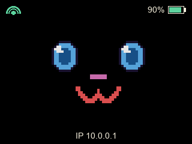
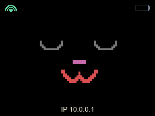

# Yahboom Dogzilla Lite Monitor

`yahboom-dogzilla-lite-monitor` is a small Python status-screen app for a
Raspberry Pi mounted on a Yahboom Dogzilla Lite setup. It renders a simple
on-device display showing:

- internet connectivity
- whether station telemetry is fresh
- the primary Dogzilla battery level when available
- WLAN IPv4 addresses reported by station telemetry

## Examples

Station online, Wi-Fi connected, battery at 90%, IP `10.0.0.1`:



Station offline, Wi-Fi connected, battery unknown, IP `10.0.0.1`:



## Running

Generate protobuf Python code from the repository root before running against
real station telemetry:

```bash
make protobuf
```

Inspect the CLI locally:

```bash
cd software/station/examples/yahboom-dogzilla-lite-monitor
uv run --frozen yahboom-dogzilla-lite-monitor --help
```

Run on Raspberry Pi hardware with defaults:

```bash
uv run --frozen yahboom-dogzilla-lite-monitor
```

The image build installs it under `/opt/yahboom-dogzilla-lite-monitor` and runs
it through `yahboom-dogzilla-lite-monitor.service`.

## Flags

| Flag | Default | Description |
| --- | --- | --- |
| `--poll-interval <seconds>` | `3.0` | Seconds between status refreshes. Non-positive values fall back to `3.0`. |
| `--station-state <path>` | `/run/station/yahboom-dogzilla-lite-monitor` | Shared-memory telemetry file written by station inference mirroring. |
| `--station-state-stale-after <seconds>` | `10.0` | Age after which telemetry is treated as stale. Non-positive values fall back to `10.0`. |

## What It Does

On each refresh cycle the monitor:

1. Opens and reads the station shared-memory frame at `--station-state`.
2. Parses the generated `yahboom_dogzilla_lite` protobuf payload and extracts
   the primary battery status plus station system network telemetry.
3. Treats Wi-Fi as connected when at least one `wlan*` interface has a valid
   non-loopback IPv4 address.
4. Draws the current state with Pillow and presents it to the configured screen.

If station telemetry is missing, unreadable, or stale, the monitor keeps running
and shows the station as offline with no battery value. If the shared-memory
file appears later, it reopens it automatically.

The ST7789 backend talks directly to Linux SPI and GPIO character devices.
Non-Linux hosts can inspect the CLI, but cannot render frames.
